# Architecture Diagrams

## 1. Full System Overview

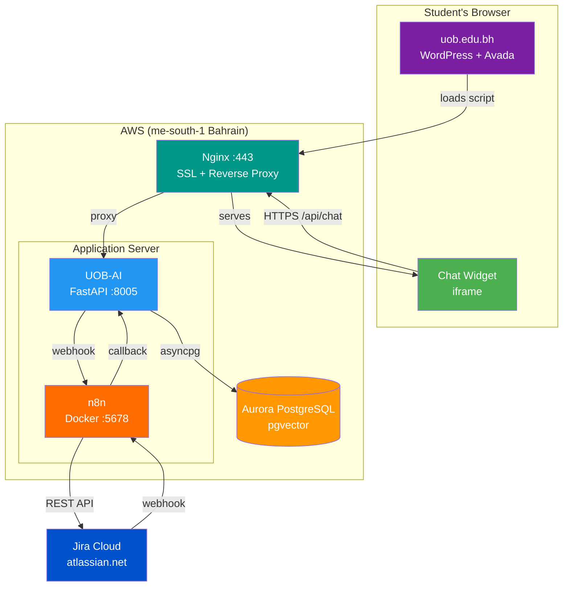

## 2. Widget Embedding on uob.edu.bh

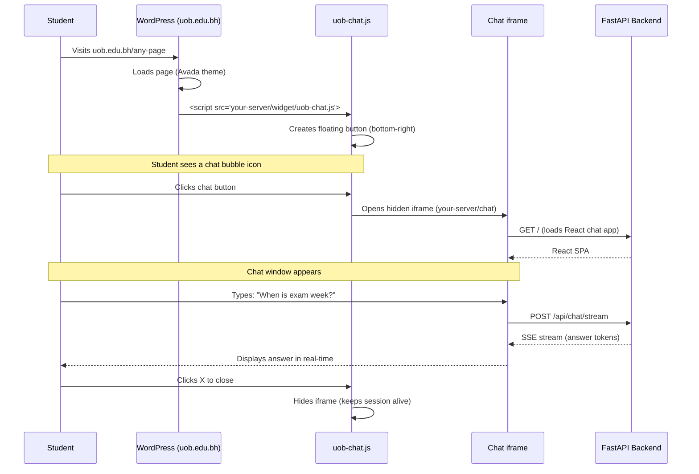

## 3. Widget UI Layout

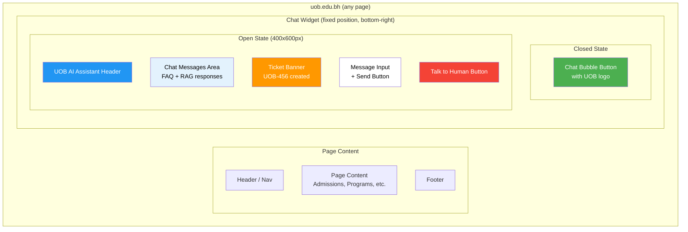

## 4. Primary Flow: Q&A (No Jira)

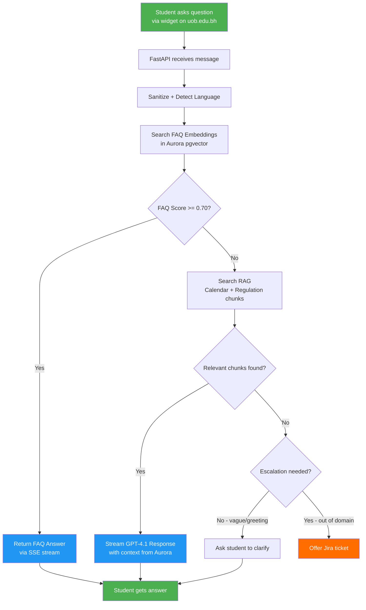

## 5. Secondary Flow: Jira Escalation

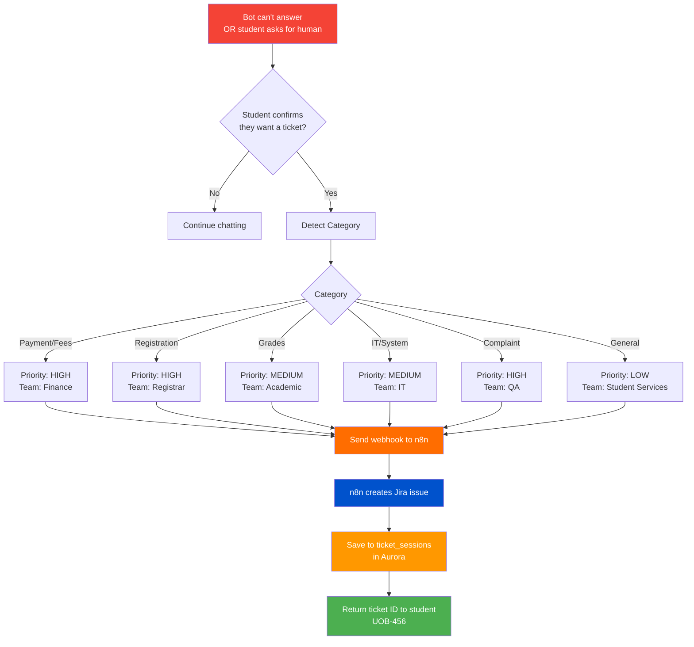

## 6. n8n Workflow 1: Escalation

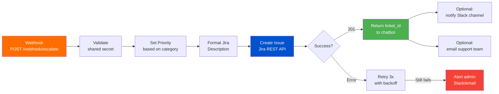

## 7. n8n Workflow 2: Status Check

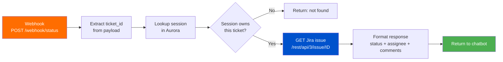

## 8. n8n Workflow 3: Jira -> Notification

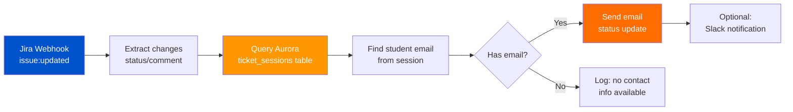

## 9. Complete Sequence: Escalation End-to-End

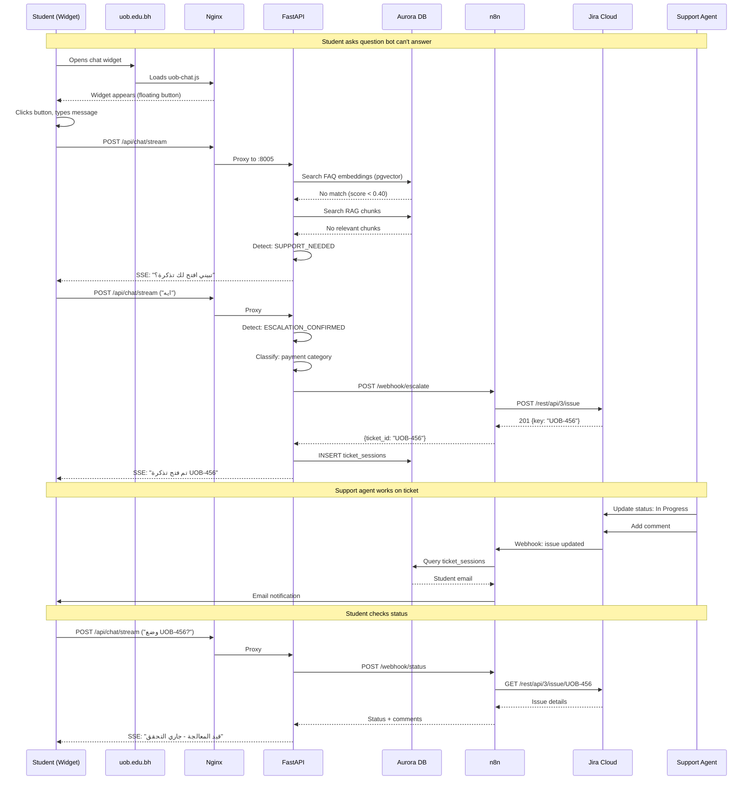

## 10. Aurora PostgreSQL Schema

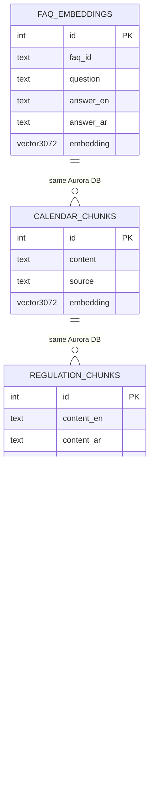

## 11. Deployment Architecture (AWS)

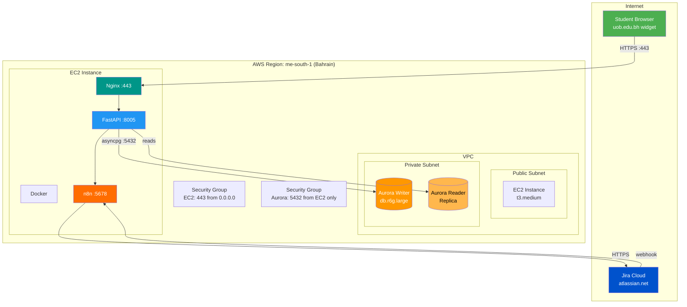

## 12. Request Flow Summary

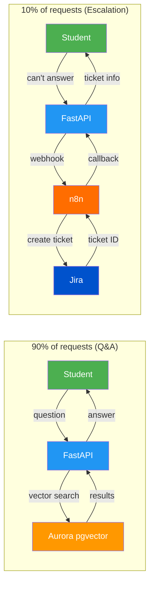
