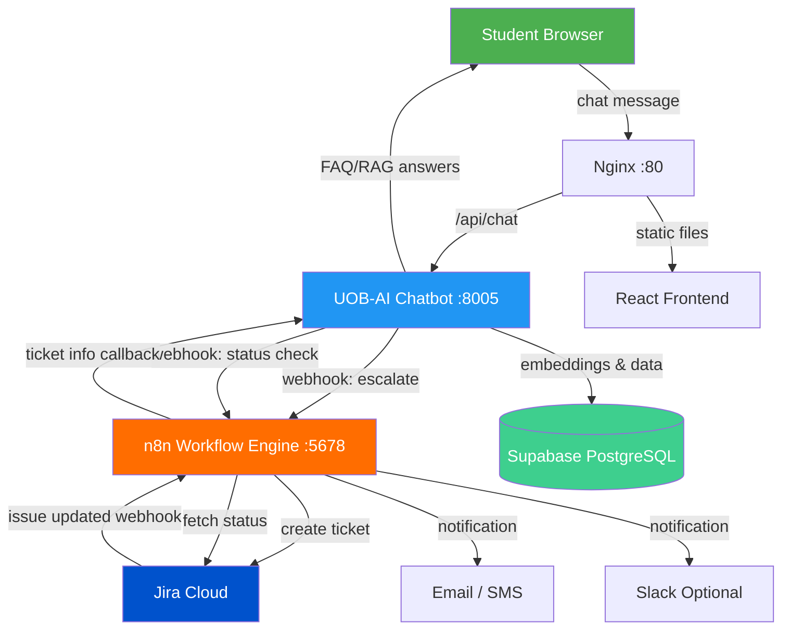
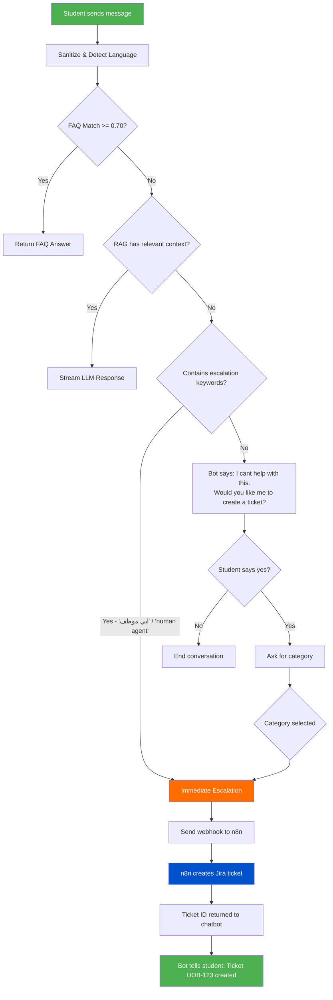
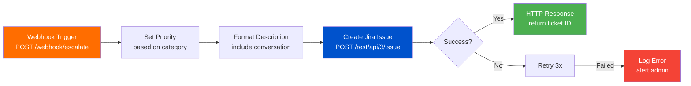
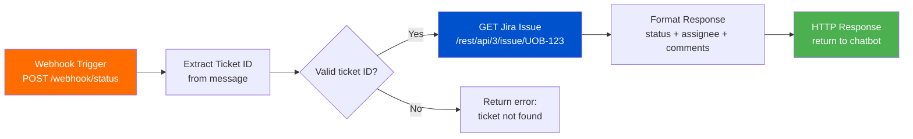
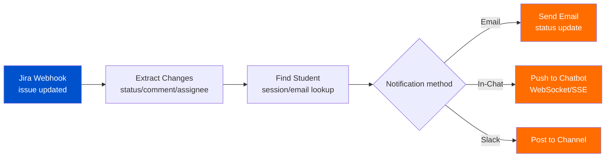
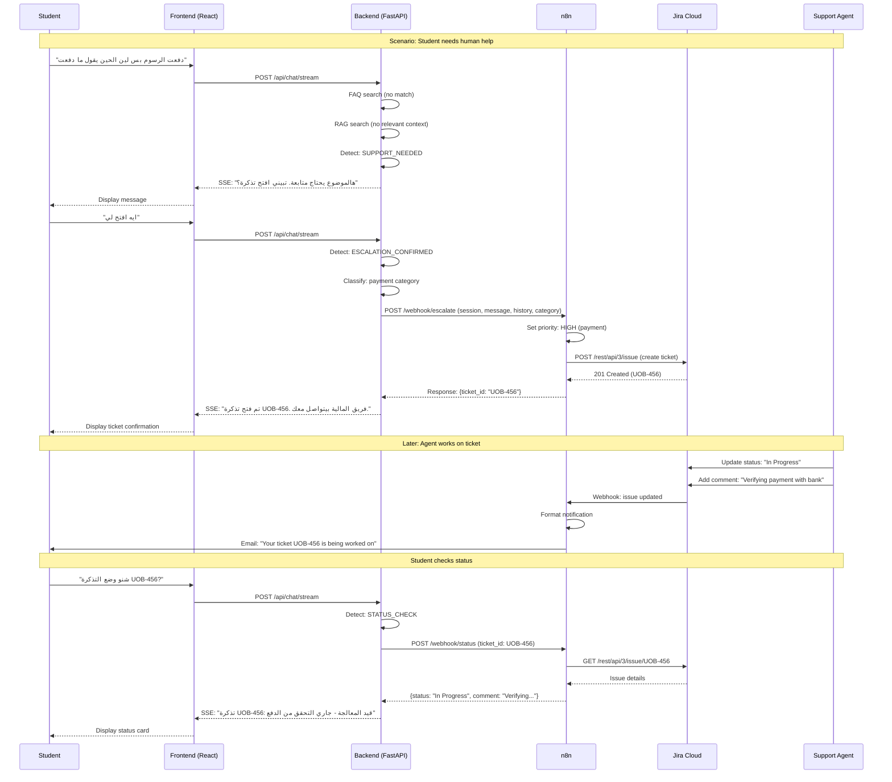
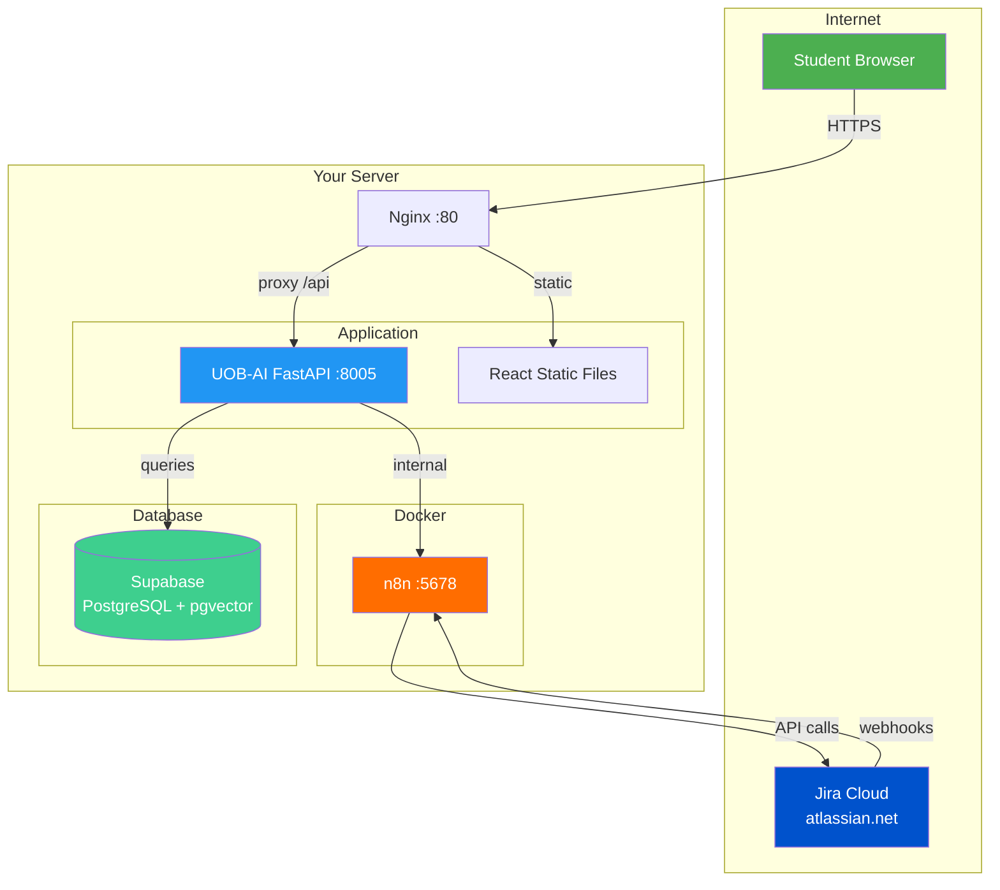
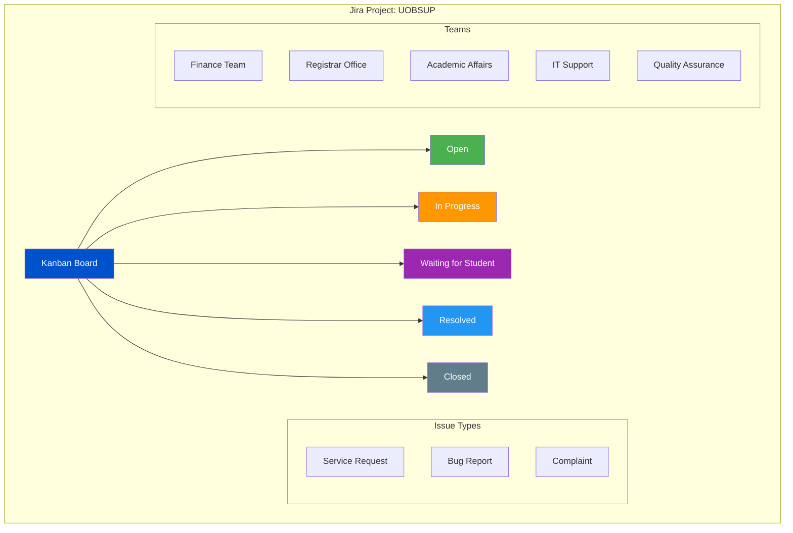

# Architecture Diagrams

## 1. System Overview

## 2. Escalation Decision Flow

## 3. n8n Workflow 1: Escalation

## 4. n8n Workflow 2: Status Check

## 5. n8n Workflow 3: Jira Notification

## 6. Complete Message Flow (Sequence Diagram)

## 7. Deployment Architecture

## 8. Jira Project Structure

