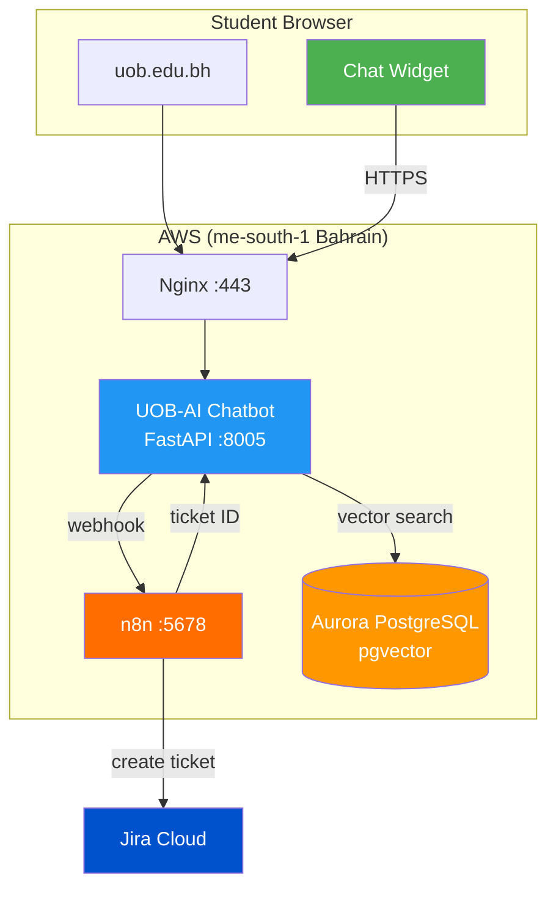

# Jira-AI

Bilingual AI chatbot widget for the University of Bahrain website (`uob.edu.bh`) with automatic tech support ticketing via Jira.

## What It Does

```
Student asks a question on uob.edu.bh
                |
                v
        AI tries to answer
         (FAQ / RAG search)
                |
        +-------+-------+
        |               |
     Answer found    No answer
        |               |
        v               v
   Bot responds     n8n sends to Jira
                        |
                        v
                  Ticket created
                  Tech Support team sees it
```

**Two jobs:**

1. **Answer questions** (primary) — academic calendar, regulations, deadlines, GPA rules
2. **Create tech support tickets** (secondary) — when the AI can't help, it creates a Jira ticket automatically via n8n

## How It Works

### The Widget

A chat widget embedded on `uob.edu.bh` (WordPress). Students see a floating chat button on every page — click it, ask a question, get an answer instantly.

```
+----------------------------------+
|  uob.edu.bh (any page)          |
|                                  |
|  [Page content...]               |
|                                  |
|                    +----------+  |
|                    | Chat     |  |
|                    | Widget   |  |
|                    |          |  |
|                    | Ask me   |  |
|                    | anything |  |
|                    +----------+  |
+----------------------------------+
```

### The AI (UOB-AI)

The chatbot backend ([UOB-AI](https://github.com/xAbdullaShaker/UOB-AI)) handles all the intelligence:

- Bilingual (Arabic + English) with Gulf dialect support
- FAQ matching (49 Q&A pairs) for instant answers
- RAG pipeline for regulation and calendar questions
- Streams responses in real-time via SSE

### The Ticketing (n8n + Jira)

When the AI **can't answer** a question and it's a **technical issue**, n8n creates a Jira ticket:

```
Chatbot ----webhook----> n8n ----API----> Jira
        (POST request)       (creates)    (ticket)
                                            |
                                            v
                                    Tech Support Team
                                    sees the ticket
```

**n8n** is the middleware — the chatbot sends it a webhook, n8n creates the Jira ticket, and returns the ticket ID back to the student.

### What Gets a Ticket (Tech Issues Only)

| Issue | Ticket? | Example |
|-------|---------|---------|
| System down / error 500 | Yes (Critical) | "البوابة ما تفتح" |
| Can't login / locked out | Yes (High) | "can't login to the portal" |
| Portal bugs / crashes | Yes (High) | "الصفحة تطلع خطأ" |
| Email not working | Yes (Medium) | "الايميل ما يشتغل" |
| Hardware (printer, lab) | Yes (Low) | "الطابعة ما تطبع" |
| General tech help | Yes (Low) | "مساعدة تقنية" |

### What Does NOT Get a Ticket

| Issue | What happens instead |
|-------|---------------------|
| "When is exam week?" | Bot answers from FAQ |
| "How do I change my major?" | Bot answers from regulations |
| "I want to pay fees" | Bot redirects to Finance Office |
| "What's my GPA?" | Bot redirects to student portal |

## Architecture



## Tech Stack

| Component | Technology | Purpose |
|-----------|-----------|---------|
| **Chatbot** | Python, FastAPI, OpenAI GPT-4.1 | AI backend |
| **Frontend** | React, Vite | Chat UI (widget) |
| **Database** | Amazon Aurora PostgreSQL + pgvector | Embeddings & ticket tracking |
| **Automation** | n8n (self-hosted) | Webhook middleware |
| **Ticketing** | Jira Cloud | Tech support tickets |
| **Web Server** | Nginx | SSL, reverse proxy |
| **Hosting** | AWS EC2 (me-south-1 Bahrain) | Everything runs here |

## Repo Structure

```
Jira-AI/
|-- README.md                    # You're here
|-- PLAN.md                      # Detailed implementation plan
|-- ARCHITECTURE.md              # Mermaid diagrams
|
|-- n8n/
|   |-- docker-compose.yml       # Run n8n
|   |-- .env.example             # Credentials template
|   |-- workflows/
|       |-- escalation.json      # Chatbot -> Jira ticket
|       |-- status-check.json    # Student checks ticket status
|       |-- jira-notify.json     # Jira update -> notification
|
|-- chatbot-plugin/
|   |-- escalation.py            # Detects tech issues
|   |-- categories.py            # Category & priority mapping
|   |-- n8n_client.py            # Sends webhooks to n8n
|   |-- models.py                # Data models
|
|-- widget/
|   |-- uob-chat.js              # Embed script for WordPress
|   |-- widget.css               # Floating button styles
|
|-- db/
|   |-- migration.sql            # Aurora schema
|
|-- tests/
    |-- test_escalation.py
    |-- test_categories.py
```

## How n8n Works Here

n8n runs on the same server as the chatbot. It listens for webhooks and talks to Jira:

**1. Chatbot detects a tech issue it can't solve**

**2. Chatbot sends a POST request to n8n:**
```json
{
  "session_id": "uuid-abc-123",
  "message": "البوابة ما تفتح معي، يطلع خطأ 500",
  "category": "bug",
  "priority": "high",
  "language": "ar"
}
```

**3. n8n receives it and creates a Jira ticket:**
```
[Webhook] -> [Set Priority] -> [Create Jira Issue] -> [Return Ticket ID]
```

**4. Chatbot tells the student:**
```
"تم فتح تذكرة UOB-456. فريق الدعم التقني بيتابعون الموضوع."
```

All tickets go to **one Tech Support team**. Labels (outage, access, bug, etc.) help them prioritize.

## Example Conversations

### Bot answers (no ticket needed)

```
Student: When does spring semester start?
Bot:     Spring semester 2025/2026 begins on January 25, 2026.
```

### Tech issue -> ticket created

```
Student: البوابة ما تفتح معي، يطلع خطأ 500
Bot:     يبدو إن فيه مشكلة تقنية في البوابة.
         تم فتح تذكرة رقم UOB-456
         فريق الدعم التقني بيتابعون الموضوع.
```

### Non-tech issue -> redirect

```
Student: I paid my fees but it still shows unpaid
Bot:     For payment issues, please contact the Finance Office:
         - Visit: Administration Building, Ground Floor
         - Email: finance@uob.edu.bh
```

## Related Repos

- [UOB-AI](https://github.com/xAbdullaShaker/UOB-AI) — The chatbot backend (FAQ + RAG pipeline)

## Docs

- [PLAN.md](PLAN.md) — Full implementation plan with phases, code examples, and security details
- [ARCHITECTURE.md](ARCHITECTURE.md) — All system diagrams (Mermaid)
